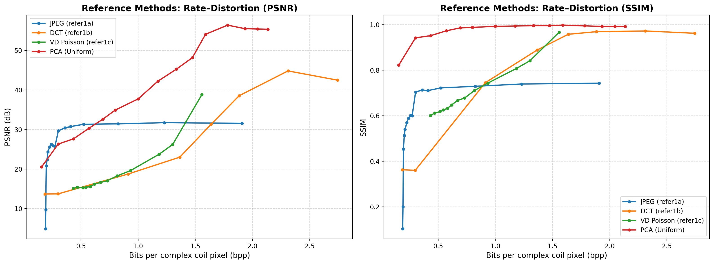

# MRI Coil Compression Methods - Rate-Distortion Analysis

This repository implements and compares various compression methods for multi-coil MRI data, evaluating their rate-distortion performance using PSNR and SSIM metrics computed on magnitude images.

## Environment Setup

### Prerequisites
- Python 3.9+
- CUDA-capable GPU (recommended)
- Conda package manager

### Installation

1. Create and activate the conda environment:
```bash
conda create -n ee274_project_env python=3.9
conda activate ee274_project_env
```

2. Install required packages:
```bash
pip install torch numpy scipy matplotlib sigpy scikit-image pillow tqdm
```

## How to Run

### Run All Experiments

To run all compression methods sequentially:

```bash
conda activate ee274_project_env
python run_all.py
```

This will execute:
1. Reference image generation (refer0)
2. JPEG compression (refer1a)
3. DCT compression (refer1b)
4. FFT/VD Poisson undersampling (refer1c)
5. Uniform PCA coil compression (uniform_coil_compression)

### Run Individual Experiments

You can also run individual scripts (no PYTHONPATH setup needed):

```bash
# Generate reference image
python scripts/refer0_generate_reference.py

# JPEG compression
python scripts/refer1a_jpeg_compression.py

# DCT compression
python scripts/refer1b_DCT_compression.py

# FFT/VD Poisson compression
python scripts/refer1c_FFT_compression.py

# Uniform PCA compression
python scripts/uniform_coil_compression.py
```

### Generate Rate-Distortion Curves

To plot the combined rate-distortion curves for all methods:

```bash
python plot_rd_all.py
```

This generates `results/rd_curve_references.png` with separate plots for PSNR and SSIM.

## Method Descriptions

### refer0: Reference Image Generation

**Purpose**: Generates the ground truth reference image for evaluation.

**Input Data Path**:
- Raw multi-coil complex images are loaded from:  
  `dataset/imgs.pt`  
  *(Replace `DATASET_NAME` with your actual dataset folder name.)*

**Method**:
- Loads multi-coil complex images (shape: 64 × 294 × 294)
- Converts to k-space
- Estimates coil sensitivity maps using the ESPIRiT algorithm [(Uecker et al., 2014)](https://ieeexplore.ieee.org/document/6876307)
- Combines coil images using sensitivity-weighted combination
- Normalizes the final image

**Output**: 
- `results/refer0/ref_image.pt`: Reference combined image
- `results/refer0/sensitivity_maps.pt`: Estimated sensitivity maps

**Key Parameters**:
- Calibration region: 32×32 center k-space
- ESPIRiT threshold: 0.02
- Kernel width: 6

---

### refer1a: JPEG Compression

**Purpose**: Baseline JPEG compression [(Pennebaker & Mitchell, 1992)](https://ieeexplore.ieee.org/document/210764) applied to coil images.

**Method**:
- Separates real and imaginary components of coil images
- Tiles all coil images into a mosaic
- Applies JPEG compression to real and imaginary mosaics separately
- Reconstructs coil images from compressed mosaics
- Uses ESPIRiT to combine coils into final image

**Hyperparameters**:
- JPEG quality: [1, 5, 10, 15, 20, 30, 40, 50, 60, 70, 80, 85, 90, 95, 98, 100]

**Output**: 
- `results/refer1a_jpeg_compression/results_jpeg.pt`: Rate-distortion results
- Individual reconstructed images for each quality setting

**Characteristics**:
- Simple baseline method
- Works in image domain
- Moderate compression efficiency
- Quality degrades at low bit rates

---

### refer1b: DCT Compression (Water-Filling)

**Purpose**: 2D Discrete Cosine Transform compression with magnitude-based coefficient selection.

**Method**:
- Applies 2D DCT to real and imaginary components separately
- Performs global magnitude-based thresholding (water-filling)
- Keeps top-k DCT coefficients by magnitude across all coils
- Quantizes and compresses remaining coefficients using zlib
- Reconstructs via inverse DCT

**Hyperparameters**:
- Keep ratio: [0.005, 0.01, 0.05, 0.1, 0.15, 0.2, 0.3, 0.5]
- Quantization bits: 9

**Output**: 
- `results/refer1b_dct_compression/results_dct.pt`: Rate-distortion results

**Characteristics**:
- Frequency-domain compression
- Global coefficient selection optimizes rate-distortion
- Good performance at medium bit rates
- Preserves important frequency components

---

### refer1c: FFT Compression (VD Poisson Undersampling)

**Purpose**: Variable-density Poisson disc undersampling in k-space.

**Method**:
- Converts coil images to k-space
- Generates variable-density Poisson disc sampling masks
- Samples k-space according to mask
- Quantizes and compresses sampled k-space values
- Compresses sampling mask using zlib
- Reconstructs via zero-filled IFFT and ESPIRiT

**Hyperparameters**:
- Acceleration factors: [1, 1.5, 2, 3, 4, 5, 6, 7, 8, 9, 10, 12, 14]
- Quantization bits: 9
- Calibration region: 32×32 (always fully sampled)

**Output**: 
- `results/refer1c_fft_compression/results_fft.pt`: Rate-distortion results

**Characteristics**:
- Works directly in k-space (native MRI domain)
- Variable-density sampling preserves center k-space
- ESPIRiT reconstruction handles aliasing
- Good performance at low to medium bit rates
- Natural for MRI acquisition simulation

---

### uniform_coil_compression: PCA-Based Uniform Compression

**Purpose**: Principal Component Analysis (PCA) for uniform coil compression.

**Method**:
- Reshapes coil images into vectors
- Computes covariance matrix across coils
- Performs eigendecomposition
- Selects top-K principal components
- Projects data onto PCA basis
- Quantizes and compresses PCA coefficients
- Stores PCA basis vectors (overhead)
- Reconstructs via inverse PCA transform

**Hyperparameters**:
- PCA rank (K): [1, 2, 3, 4, 5, 6, 8, 10, 12, 14, 16, 20, 24, 28, 32]
- Quantization bits: 8

**Output**: 
- `results/uniform_coil_compression/results_pca.pt`: Rate-distortion results

**Characteristics**:
- Exploits correlation across coils
- Global basis shared across all spatial locations
- Excellent performance at medium to high bit rates
- Basis overhead becomes significant at low ranks
- Best quality among tested methods at high bit rates

---

### dynamic_coil_compression: Dynamic Band-Wise FFT+PCA

**Status**: ⚠️ **Still Ongoing** - Under active development

**Purpose**: Adaptive compression using frequency-band-dependent PCA ranks.

**Proposed Method**:
- Divides k-space into radial frequency bands (low, mid, high)
- Applies different PCA ranks to each band
- Low frequencies: higher rank (more components)
- High frequencies: lower rank (fewer components)
- Adapts compression to signal characteristics

**Expected Characteristics**:
- Better rate-distortion than uniform PCA
- Adaptive to frequency content
- More complex implementation

---

## Rate-Distortion Results

Below is an example of the generated rate-distortion curves comparing all methods:

<p align="center">
  
</p>

The rate-distortion curves (`rd_curve_references.png`) compare all methods using:

- **X-axis**: Bits per complex coil pixel (bpp)
- **Y-axis (left)**: PSNR (dB) computed on magnitude images
- **Y-axis (right)**: SSIM computed on magnitude images

### Key Observations

1. **Uniform PCA (Red)**: 
   - Best performance at medium to high bit rates (>1.0 bpp)
   - Achieves highest PSNR (~56 dB) and SSIM (~0.998) at ~2.0 bpp
   - Exploits coil correlations effectively

2. **DCT Water-Filling (Orange)**:
   - Good performance across bit rate range
   - Better than JPEG at all bit rates
   - Frequency-domain compression preserves important components

3. **VD Poisson FFT (Green)**:
   - Excellent at low to medium bit rates (<1.0 bpp)
   - Natural for MRI (k-space domain)
   - Variable-density sampling preserves center k-space

4. **JPEG (Blue)**:
   - Baseline method, lowest performance
   - Simple but less efficient
   - Quality degrades significantly at low bit rates

### Trade-offs

- **Low bit rates (<0.5 bpp)**: VD Poisson FFT performs best
- **Medium bit rates (0.5-1.5 bpp)**: DCT and VD Poisson competitive
- **High bit rates (>1.5 bpp)**: Uniform PCA dominates

All metrics (PSNR and SSIM) are computed on **magnitude images** to reflect perceptual quality in MRI visualization.

## File Structure

```
EE274_dynamic_coil_compression/
├── README.md
├── run_all.py                 # Main script to run all experiments
├── plot_rd_all.py            # Generate combined RD curves
├── scripts/
│   ├── refer0_generate_reference.py
│   ├── refer1a_jpeg_compression.py
│   ├── refer1b_DCT_compression.py
│   ├── refer1c_FFT_compression.py
│   ├── uniform_coil_compression.py
│   └── dynamic_coil_compression.py  # Work in progress
├── utils/
│   ├── mri_utils.py           # MRI processing utilities
│   ├── espirit_torch.py       # ESPIRiT implementation
│   └── plot_utils.py          # Plotting utilities
└── results/
    ├── refer0/                # Reference images
    ├── refer1a_jpeg_compression/
    ├── refer1b_dct_compression/
    ├── refer1c_fft_compression/
    ├── uniform_coil_compression/
    └── rd_curve_references.png # Combined RD plot
```

## Notes

- All compression methods use magnitude-based PSNR and SSIM for evaluation
- BPP (bits per pixel) is calculated as total bits / (N_coils × H × W)
- ESPIRiT is used for final image reconstruction in all methods
- Results are saved as PyTorch tensors for easy loading and analysis

## References

- ESPIRiT: Uecker et al., "ESPIRiT—an eigenvalue approach to autocalibrating parallel MRI: where SENSE meets GRAPPA", MRM 2014
- Variable-density Poisson sampling: Lustig et al., "Sparse MRI: The application of compressed sensing for rapid MR imaging", MRM 2007
- JPEG: Wallace, G. K., "The JPEG still picture compression standard," Communications of the ACM, 1991

